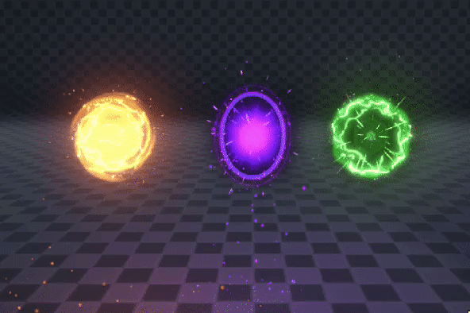

# UnityPortalVFX
This project was a test task for Unity technical artist role.

The task was to recreate one of the following provided examples:

The shader was written by me from scratch using Cg shading language.

This project was built in Unity 2020.3.18f1
